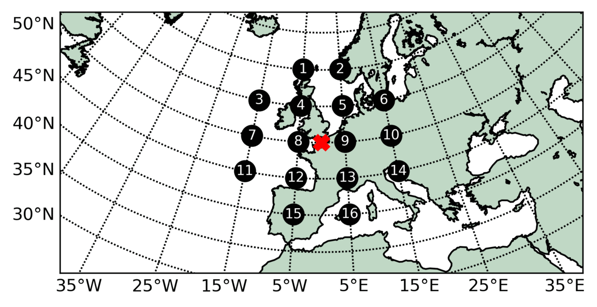

The automated Jenkinson & Collison classification for Python
===================================

**jcclass** is a Python library to derive automated atmospheric surface circulatons
based on Mean Sea Level Pressure data. The circulations are derived using the Jenkinson and Collison
automated classification originally derived from the Lamb Weather types.

.. image:: ../../figs/Circulations_quick.gif
*Example of the derived circulation types and isobars (hPa) during a given day*

How does it work?
------------
The method uses grid-point mean sea level pressure (MSLP) data to obtain numerical values of wind flow and vorticity which can be used to determine Cyclonic and Anticyclonic patterns as well as their dominant advective (direction of wind flow) characteristics. The 16 gridded points are moved along the region in reference to a central point where the dominant circulation type will be designated.

*Moving central grid point and 16 gridded points of mean sea level pressure used to compute the circulation type*

Computation
------------

- Westerly flow

:math:`W = \frac{1}{2}(P_12 + P_13) -  \frac{1}{2}(P_4 + P5)`

- Southerly flow

:math:`S = sc[\frac{1}{4}(P_5 + 2P_9 + P_{13}) - \frac{1}{4}(P_4 + 2P_8 + P_{12})]`

- Resultant flow

:math:`F = \sqrt{S^2 + W^2}`

- Westerly shear vorticity

:math:`ZW = zwb[\frac{1}{2}(P_{15} + P_{16}) - \frac{1}{2}(P_8 + P_9)] - zsc[\frac{1}{2}(P_8 + P_9) - \frac{1}{2}(P_1 + P_2)]`

- Southerly shear vorticity

:math:`ZS = zwa[\frac{1}{4}(P_6 + 2P_{10} + P_{14}) - \frac{1}{4}(P_5 + 2P_9 + P_{13}) -\frac{1}{4}(P_4 + 2P_8 + P_{12}) + \frac{1}{4}(P_3 + 2P_7 + P_{11}]`

- Total shear vorticity

:math:`Z = ZW + ZS`

The flow units are geostrophic, expressed as hPa per 10º latitude; each unit is equivalent to 1.2 knots (0.6 m/s). The geostrophic units are expressed as hPa per 10º latitude; 100 units are equivalent to :math:`0.55 x 10^{-4} = 0.46` time the Coriolis parameter.

The latitude dependant constants account for the relative differences between the grid-point spacing in the east-west and north-south direction and are defined as follows (being :math: `\phi` the latitude of the central point):

:math:`sc = \frac{1}{\cos{\phi}}`

:math:`zwa = \frac{\sin{\phi}}{\sin{\phi - 5}}`

:math:`zwb = \frac{\sin{}\phi}{\sin{\phi + 5}}`

:math:`zsc = \frac{1}{2(\cos^2{\phi})}`

The rules to define the appropiate Circulation Type (Lamb weather type) are:

1. The direction of flow is :math:`\tan^{-1}{(W/S)}`. Add 180º if :math:`W` is positive. The appropiate direction is calculated on an eight-point compass allowing 45º per sector. Thus :math:`W` occurs between 247.5º and 292.5º

2. If :math:`|Z| < F`, flow is essentially straight and corresponds to a Lamb pure directional type (NE, E, SE, S, etc).

3. If :math:`|Z| > 2F`, then the pattern is strongly cyclonic :math:`(Z>0)` or anticyclonic :math:`(Z<0)`. This corresponds to a Lamb's pure cyclonic and anticyclonic type (A or C).

4. If :math:`|Z|` lies between :math:`F` and :math:`2F` (:math:`F < |Z| < 2F`) then the flow is partly (anti)-cyclonic. The flow is considered a hybrid type and is therefore characterised by both direction and circulation (ANE, AE, ASE, ...., AN and CNE, CE, CSE, ..., CN)

5. If :math:`F < 6` and :math:`|Z| < 6`, there is light indeterminate flow, corresponding to Lamb's unclassified type, represented here as Low Flow type (LF).

Detailed method in `Jones et al. (1993) <https://rmets.onlinelibrary.wiley.com/doi/10.1002/joc.3370130606>`_ and `Otero et al. (2018) <https://link.springer.com/article/10.1007/s00382-017-3705-y>`_.

The Circulation Types (CTs)
------------
The application of the automated classification allows to derive 27 synoptic circulations. 26 of them based on the dominant pressure pattern and wind direction plus a Low Flow (LF). This last CT is characterised by days when pressure gradients are to weak and a dominant circulation or advective direction can not be assigned.

The names, abreviations and corresnding code for the CTs is as follows:

+---------------------------+-----------+------+-------------+-----------+------+----------------------+-----------+------+
|    Name                   |Abreviation|Coding|  Name       |Abreviation|Coding|  Name                |Abreviation|Coding|
+===========================+===========+======+=============+===========+======+======================+===========+======+
|Low Flow                   | LF        | -1   |      --     |     --    |  --  |       --             |   --      |    --|
+---------------------------+-----------+------+-------------+-----------+------+----------------------+-----------+------+
|Anticyclonic               | A         | 0    |    --       |      --   | --   |Cyclonic              | C         | 20   |
+---------------------------+-----------+------+-------------+-----------+------+----------------------+-----------+------+
|Anticyclonic Northeasterly | ANE       | 1    |Northeasterly| NE        | 11   |Cyclonic Northeasterly| CNE       | 21   |
+---------------------------+-----------+------+-------------+-----------+------+----------------------+-----------+------+
|Anticyclonic Easterly      | AE        | 2    |Easterly     | E         | 12   |Cyclonic Easterly     | CE        | 22   |
+---------------------------+-----------+------+-------------+-----------+------+----------------------+-----------+------+
|Anticyclonic Southeasterly | ASE       | 3    |Southeasterly| SE        | 13   |Cyclonic Southeasterly| CSE       | 23   |
+---------------------------+-----------+------+-------------+-----------+------+----------------------+-----------+------+
|Anticyclonic Southerly     | AS        | 4    |Southerly    | S         | 14   |Cyclonic Southerly    | CS        | 24   |
+---------------------------+-----------+------+-------------+-----------+------+----------------------+-----------+------+
|Anticyclonic Southwesterly | ASW       | 5    |Southwesterly| SW        | 15   |Cyclonic Southwesterly| CSW       | 25   |
+---------------------------+-----------+------+-------------+-----------+------+----------------------+-----------+------+
|Anticyclonic Westerly      | AW        | 6    |Westerly     | W         | 16   |Cyclonic Westerly     | CW        | 26   |
+---------------------------+-----------+------+-------------+-----------+------+----------------------+-----------+------+
|Anticyclonic Northwesterly | ANW       | 7    |Northwesterly| NW        | 17   |Cyclonic Northwesterly| CNW       | 27   |
+---------------------------+-----------+------+-------------+-----------+------+----------------------+-----------+------+
|Anticyclonic Northerly     | AN        | 8    |Northerly    | N         | 18   |Cyclonic Northerly    | CN        | 28   |
+---------------------------+-----------+------+-------------+-----------+------+----------------------+-----------+------+

The original 27 circulations can be reduced to a set of 11 patterns based on their dominant advection (wind direction), e.g., A previously AE, E and CE would merge into an Easterly (E).
The names, abreviations and corresponding codes are as follows:

+-----------------------+-------------+-------+
|Name                   | Abreviation | Coding|
+=======================+=============+=======+
|Low Flow               | LF          | -1    |
+-----------------------+-------------+-------+
|Anticyclonic           | A           | 0     |
+-----------------------+-------------+-------+
|Northeasterly          | NE          | 1     |
+-----------------------+-------------+-------+
|Easterly               | E           | 2     |
+-----------------------+-------------+-------+
|Southeasterly          | SE          | 3     |
+-----------------------+-------------+-------+
|Southerly              | S           | 4     |
+-----------------------+-------------+-------+
|Southwesterly          | SW          | 5     |
+-----------------------+-------------+-------+
|Westerly               | W           | 6     |
+-----------------------+-------------+-------+
|Northwesterly          | NW          | 7     |
+-----------------------+-------------+-------+
|Northerly              | N           | 8     |
+-----------------------+-------------+-------+
|Cyclonic               | C           | 9     |
+-----------------------+-------------+-------+

Working datasets
------------

The current code has been tested and works for the following datasets:

- `ERA5 Reanalysis <https://www.ecmwf.int/en/forecasts/datasets/reanalysis-datasets/era5>`_.

- `NOAA 20th Century Reanalysis (V3) <https://psl.noaa.gov/data/gridded/data.20thC_ReanV3.html>`_.

- `Global Climate Models from the Coupled Model Intercomparison Project CMIP6 <https://esgf-node.llnl.gov/projects/cmip6/>`_.

The **jcclass** can be applied for any other netcdf files with latitude, longitude coordinates named as "lat", "latitude", "lon", "longitude" and MSLP coordinate names as "msl" or "psl".

.. note::
   If the MSLP coordinate name is not know, the **jcclass** allows you to input the coordinate name when running the code

Check out the :doc:`usage` section for further information, including
the :ref:`installation` procedure.

.. note::
   This project is under active development.

Documentation
-------------

.. toctree::
   installation
   tutorial
   api
