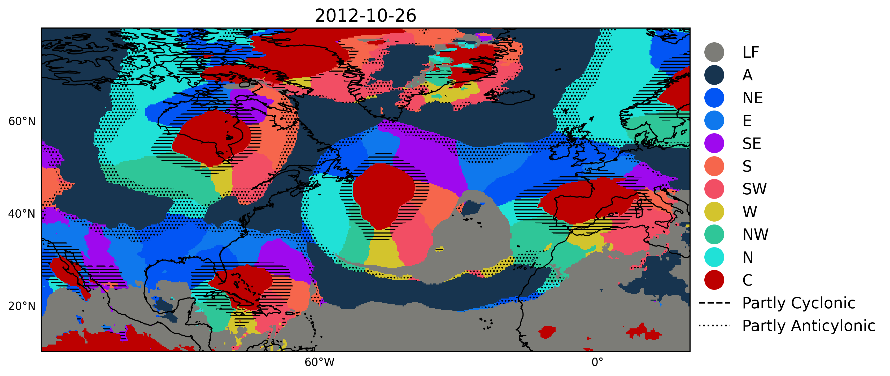
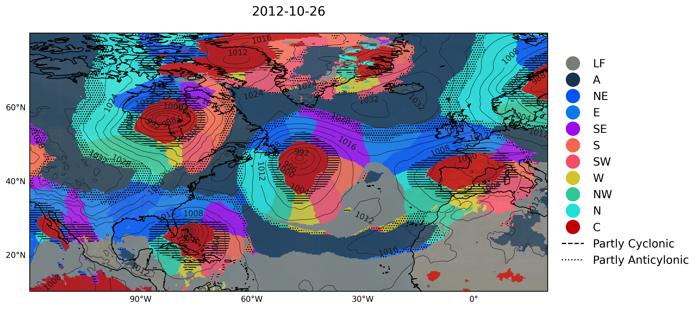

Tutorial
========

The module contains one class ``jcclass.jc`` which works with MSLP netcdf files. Import the respective module as:

.. code:: py

   from jcclass import jc

We will use a sample dataset from ERA5 Reanalysis with daily mean MSLP (download `here <https://github.com/PedroLormendez/jc_module/blob/main/sample_data/era5_daily_lowres.nc>`_). 

.. note:: 

   A higuer resolution dataset (0.25 x 0.25º) on hourly data is available also `here <https://github.com/PedroLormendez/jc_module/blob/main/sample_data/era5_hourly_highres.nc>`_
   
Computing the CTS
-----------------

.. code:: py

   filename = 'era5_daily_lowres.nc'
   cts_27 = jc(filename).classification()

Reducing to 11 CTs
------------------

Reducing the original 27 CTs to eleven can be done by running:

.. code:: py

   cts_11 = jc.eleven(cts_27)
   
The reduced number of circulation types can be saved as a netcdf

.. code:: py

   cts_11.to_netcdf('output.nc')
   
Plotting the CTs
----------------

There are three options to visualise the circulation types on a map using ``cartopy``.

Only CTs
~~~~~~~~

.. code:: py

   import xarray as xr #to select an specifc date
   date = cts_27.time[0] #selecting the date 
   cts = cts_27.sel( time = date ) #Extracting only a 2D DataArray ['lat', 'lon']
   fig = jc.plot_cts(cts, **kwargs)
   
**cts**       : *DataArray*, a 2D ['lat','lon'] DataArray of the 27 CTs.

** **kwargs** : *int*, **optional**

   lon_west : westernmost longitude (-180 to 180). 
   
   lon_east : easternmost longitude value (-180 to 180). 
   
   lat_south: southernmost latitude value (-90 to 90). 
   
   lat_north: northernmost latitude value (-90 to 90). 
   

CTs + isobars 
~~~~~~~~~~~~~

.. code:: py

   mslp = xr.open_dataset(filename).sel(time = date) #extracting MSLP on the same day as the CTs
   
   fig = jc.plot_cts_mslp(cts, mslp, **kwargs)
   
**mslp**       : *DataArray*, a 2D ['lat','lon'] DataArray of the MSLP data.   
   

CTs on a sphere  
~~~~~~~~~~~~~~~
This plots the circulation types and the MSLP contour lines using the ``Nearside`` perspective of ``cartopy``.

.. code:: py
   
   fig = jc.plot_cts_globe(cts, mslp, *kwargsglobe)

** **kwargs** : *int*, **optional**

   lat_central : central latitude value (-90 to 90). 
   
   lon_central : central longitude value (-180 to 180). 

.. image:: ../../figs/plot_cts_globe.png
